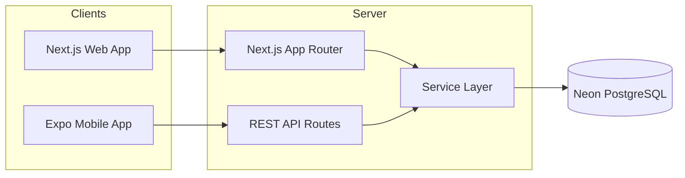
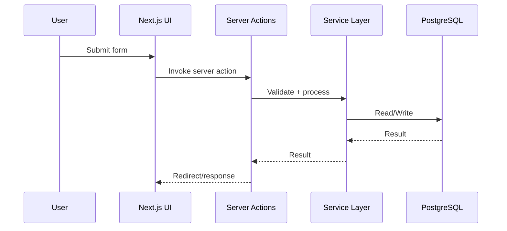
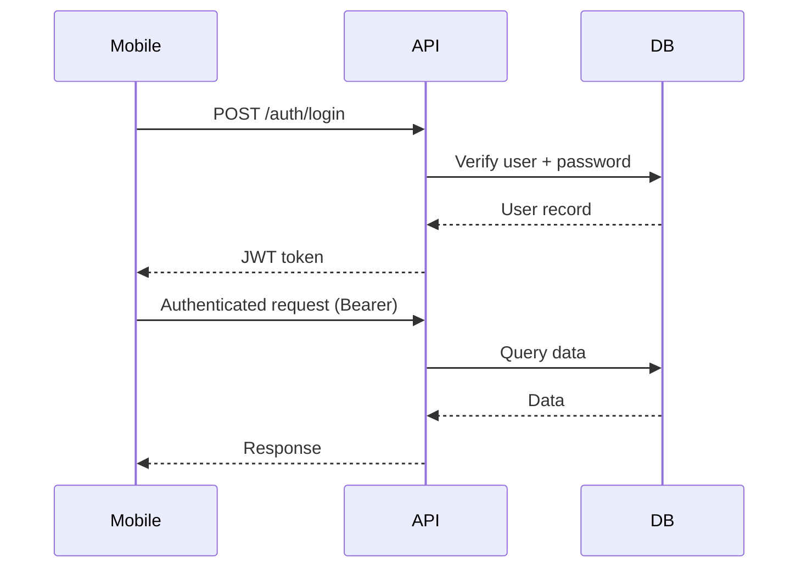

# Architecture

## System Overview
Badminton Club Planner is a monorepo, full-stack application with a Next.js web app, a REST API, and an Expo React Native mobile app. The system follows a client-server model with a dedicated service/data layer and shared TypeScript utilities.

Key characteristics:
- **Monorepo structure** with npm workspaces
- **Next.js App Router** for web UI and server-side features
- **REST API** for the mobile app
- **PostgreSQL (Neon) + Drizzle ORM** for persistence
- **Shared TypeScript models** for cross-app consistency

## Monorepo Layout
- **badminton-web**: Next.js web app and backend (Server Actions + REST API)
- **badminton-mobile**: Expo React Native app
- **badminton-shared**: Shared types and framework-neutral utilities
- **docs**: Project documentation

## Frontend Architecture (Web)
- **Next.js App Router** for routing and server rendering
- **Server Actions** for form-driven CRUD workflows
- **Component-driven UI** using Tailwind CSS
- **Role-based UI** for managers, coaches, parents, and admins

## Backend Architecture (Web + API)
- **Server Actions** handle web CRUD flows with server-side validation
- **REST API** serves mobile clients with JWT Bearer auth
- **Service/data layer** in `src/lib` and `src/db` encapsulates queries and business logic

## Mobile Architecture
- **Expo Router** for screen navigation
- **REST API** for data access
- **Auth context** for login state and token storage
- **Optimized UI** for sessions, attendance, comments, events, and announcements

## Service Layer
The service layer centralizes business logic and database access:
- **`src/lib`**: data access and validation helpers
- **`src/db`**: Drizzle schema and database entry point
- **Server Actions** call service functions to keep UI thin

## Authentication Flow
- **JWT** issued by the web backend for mobile clients
- **HTTP-only cookies** for web sessions (Server Actions)
- **Bearer token** for mobile API calls
- **Role checks** enforced on the server

## API Communication
- **Web App** → Server Actions
- **Mobile App** → REST API routes
- **REST API** → Service layer → Database

## Database Access Flow
- **Drizzle ORM** defines schema and migrations
- **Services** query with typed Drizzle operations
- **Neon PostgreSQL** acts as the source of truth

## Mermaid Diagrams

### High-Level Architecture

### Request Flow (Web)

### Authentication Flow (Mobile)

