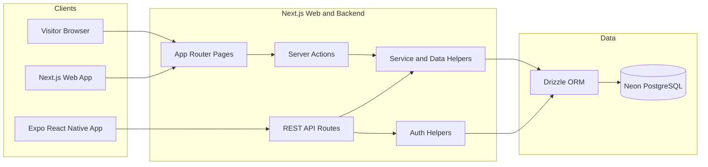
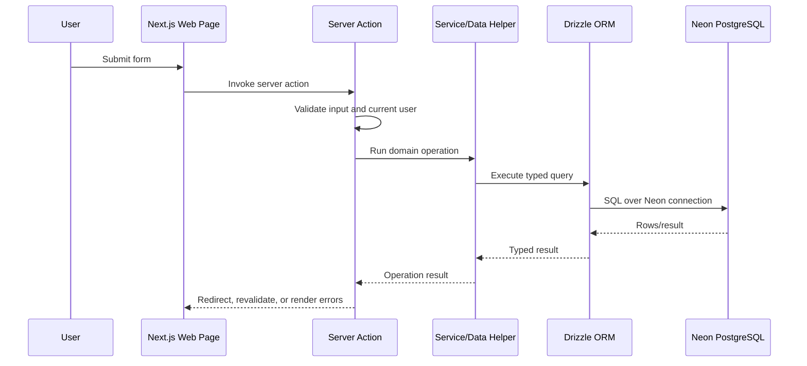
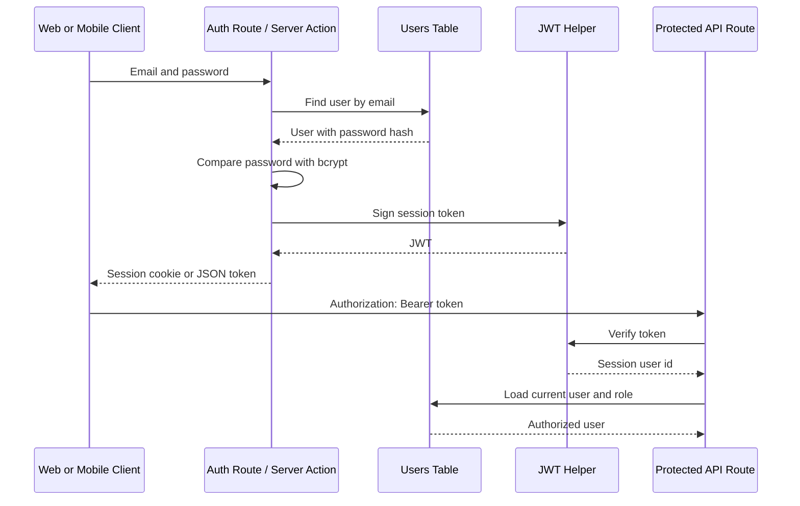
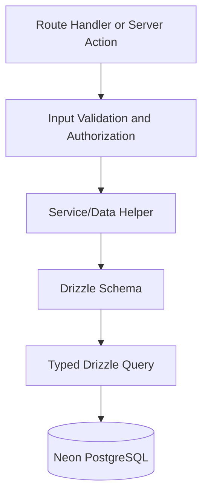

# Architecture

## System Overview

Badminton Club Planner is a monorepo full-stack application built around a client-server architecture. The Next.js application provides both the web interface and backend runtime. The Expo React Native app consumes the backend through REST endpoints, while shared TypeScript models and framework-neutral helpers can be kept in `badminton-shared`.

The application supports badminton club workflows such as group management, session scheduling, venues, attendance tracking, session comments, event registrations, invitations, coaches, parents, and players.

## High-Level Architecture

## Monorepo Explanation

The repository is organized as an npm workspace:

| Package | Responsibility |
| --- | --- |
| `badminton-web/` | Next.js web app, REST API, authentication, Drizzle schema, migrations, and database seed logic. |
| `badminton-mobile/` | Expo React Native mobile app for parents, players, and group members. |
| `badminton-shared/` | Shared TypeScript types, constants, validation helpers, and framework-neutral business rules. |
| `docs/` | Architecture, database, setup, and repository documentation. |

The current backend lives inside the Next.js app. This keeps deployment simple for a capstone project while preserving a modular structure through route handlers, Server Actions, auth helpers, Drizzle schema files, and service/data helper modules.

## Frontend Architecture

The web frontend uses the Next.js App Router.

| Area | Pattern |
| --- | --- |
| Pages | Route segments in `badminton-web/src/app`. |
| Forms | Server Actions for create, update, delete, attendance, invitations, and event workflows. |
| UI | React components in `badminton-web/src/components`. |
| Styling | Tailwind CSS and global styles in `badminton-web/src/app/globals.css`. |
| Navigation | Role-aware pages for dashboard, groups, sessions, venues, events, and auth. |

The web app is optimized for club managers and coaches who need fast access to operational workflows: scanning upcoming sessions, managing attendance, coordinating comments, editing venues, and running events.

## Backend Architecture

The backend is implemented inside `badminton-web` using the Next.js App Router.

| Backend Area | Responsibility |
| --- | --- |
| `src/app/api` | REST route handlers consumed by the mobile app and API clients. |
| `src/app/**/actions.ts` | Server Actions for web form workflows. |
| `src/auth` | JWT/session helpers, API auth, login, registration, and token validation. |
| `src/db` | Drizzle schema, database connection, and seed data. |
| `src/lib` | Domain-specific data helpers for groups, sessions, venues, events, and status logic. |

The REST API returns predictable JSON responses and uses Bearer token authentication for mobile clients. Web forms use Server Actions so validation and authorization happen on the server.

## Mobile Architecture

The mobile app is an Expo React Native application using Expo Router.

| Area | Responsibility |
| --- | --- |
| `badminton-mobile/src/app` | Mobile screens and routes. |
| `badminton-mobile/src/auth` | Auth context and secure token storage. |
| `badminton-mobile/src/lib/api.ts` | API base URL and API error helpers. |
| `badminton-mobile/src/components` | Reusable mobile UI cards and primitives. |
| `badminton-mobile/src/theme` | Mobile theme tokens. |

The mobile app communicates with the backend through REST endpoints under `/api`. The API base URL is configured with `BADMINTON_API_URL`, which is injected into Expo config as `extra.badmintonApiUrl`.

## Service Layer

The project uses a practical service/data layer architecture:

- UI components stay focused on rendering and user interaction.
- Server Actions handle web form submission, validation orchestration, redirects, and cache refreshes.
- REST route handlers handle request parsing, authentication, authorization, and JSON responses.
- Domain helpers in `src/lib` centralize reusable read models and business-oriented query logic.
- Drizzle schema and database access are kept behind `src/db`.

This structure keeps business rules out of components and makes it easier to reuse logic between web pages and API routes.

## Request Flow

## Authentication Flow

## API Communication

| Client | Backend Interface | Typical Use |
| --- | --- | --- |
| Web app | Server Actions | Create groups, manage sessions, update attendance, edit venues and events. |
| Web app | Server-rendered data helpers | Dashboard, group detail, session detail, event and venue pages. |
| Mobile app | REST API | Login, register, list sessions/events/announcements, update attendance, add comments, register for events. |

REST endpoints live under `badminton-web/src/app/api`. Authentication routes issue JWTs, while protected routes use `getApiUser()` to verify Bearer tokens and load the current user from the database.

## Database Access Flow

The database schema is defined in `badminton-web/src/db/schema.ts`. Drizzle Kit generates migrations from that schema, and the application connects to Neon PostgreSQL through `DATABASE_URL`.

## Key Architectural Decisions

| Decision | Reason |
| --- | --- |
| Monorepo | Keeps web, mobile, docs, and shared models in one evaluable project. |
| Next.js as backend | Simplifies deployment and allows Server Actions plus REST API routes in one runtime. |
| REST for mobile | Expo clients can consume stable JSON endpoints without depending on web rendering internals. |
| Drizzle ORM | Provides typed schema definitions and SQL-friendly query control. |
| Shared TypeScript package | Reduces duplication for stable types and validation rules across web and mobile. |
| Server-side authorization | Prevents role or ownership checks from relying only on client UI behavior. |
