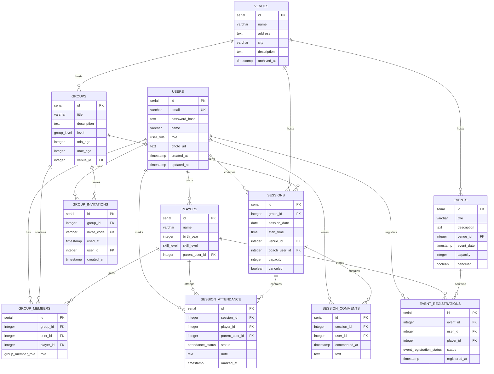

# Database Schema

## Database Overview

Badminton Club Planner uses PostgreSQL hosted on Neon DB with Drizzle ORM for schema definitions, migrations, typed queries, and seed data. The schema models real club operations: users, players, venues, groups, memberships, training sessions, attendance, comments, events, registrations, and group invitations.

The Drizzle schema is defined in `badminton-web/src/db/schema.ts`, and the database connection is configured through `DATABASE_URL`.

## Normalization

The schema is normalized around core entities:

- `users` stores account and role information.
- `players` are separated from users because parents may manage one or more players.
- `venues` are reused by groups, sessions, and events.
- `groups` represent training cohorts and are connected to users/players through `group_members`.
- `sessions` are scheduled training instances for a group.
- `session_attendance` and `session_comments` store session-specific activity.
- `events` are separate from training sessions and use `event_registrations`.
- `group_invitations` stores join codes and invitation usage.

This reduces duplication and keeps many-to-many relationships explicit.

## ERD

## Tables

### `users`

| Item | Details |
| --- | --- |
| Purpose | Stores application accounts for admins, managers, coaches, and parents. |
| Important columns | `id`, `email`, `password_hash`, `name`, `role`, `photo_url`, `created_at`, `updated_at`. |
| Foreign keys | None. |
| Relationships | Owns `players`; writes `session_comments`; marks `session_attendance`; registers for `events`; may coach `sessions`; may be listed in `group_members`. |

Notes:
- `email` is unique.
- `role` uses the `user_role` enum: `admin`, `manager`, `coach`, `parent`.
- Passwords are stored as hashes, not plain text.

### `players`

| Item | Details |
| --- | --- |
| Purpose | Represents child or player profiles managed by a parent account. |
| Important columns | `id`, `name`, `birth_year`, `skill_level`, `parent_user_id`. |
| Foreign keys | `parent_user_id` references `users.id` with cascade delete. |
| Relationships | Belongs to a parent user; joins groups through `group_members`; appears in attendance and event registration records. |

Notes:
- `birth_year` has a range check between 1900 and 2100.
- `skill_level` supports `beginner`, `intermediate`, `advanced`, and `competitive`.

### `venues`

| Item | Details |
| --- | --- |
| Purpose | Stores sports halls or locations used by groups, sessions, and events. |
| Important columns | `id`, `name`, `address`, `city`, `description`, `archived_at`. |
| Foreign keys | None. |
| Relationships | Referenced by `groups`, `sessions`, and `events`. |

Notes:
- `archived_at` supports soft retirement of venues while preserving historical records.
- `city` is indexed for browsing/filtering by location.

### `groups`

| Item | Details |
| --- | --- |
| Purpose | Represents a training group or cohort. |
| Important columns | `id`, `title`, `description`, `level`, `min_age`, `max_age`, `venue_id`. |
| Foreign keys | `venue_id` references `venues.id` with restrict delete. |
| Relationships | Contains `group_members`, `sessions`, and `group_invitations`. |

Notes:
- `level` uses `beginner`, `intermediate`, `advanced`, and `competitive`.
- A check constraint ensures `min_age <= max_age` when both values exist.

### `group_members`

| Item | Details |
| --- | --- |
| Purpose | Connects users and players to groups with a group-specific role. |
| Important columns | `id`, `group_id`, `user_id`, `player_id`, `role`, `created_at`. |
| Foreign keys | `group_id` references `groups.id`; `user_id` references `users.id`; `player_id` references `players.id`. |
| Relationships | Links groups to coaches, managers, parents, and players. |

Notes:
- Either `user_id` or `player_id` must be present.
- Unique indexes prevent the same user or player from being added to the same group more than once.
- `role` uses `manager`, `coach`, `parent`, and `player`.

### `sessions`

| Item | Details |
| --- | --- |
| Purpose | Stores scheduled training sessions for groups. |
| Important columns | `id`, `group_id`, `session_date`, `start_time`, `venue_id`, `coach_user_id`, `capacity`, `canceled`. |
| Foreign keys | `group_id` references `groups.id`; `venue_id` references `venues.id`; `coach_user_id` references `users.id`. |
| Relationships | Belongs to one group and venue; may have one coach; contains attendance and comments. |

Notes:
- `capacity` must be positive when set.
- `coach_user_id` is nullable and uses `set null` when a coach account is removed.

### `session_attendance`

| Item | Details |
| --- | --- |
| Purpose | Tracks one player's attendance status for one session. |
| Important columns | `id`, `session_id`, `player_id`, `parent_user_id`, `status`, `note`, `marked_at`. |
| Foreign keys | `session_id` references `sessions.id`; `player_id` references `players.id`; `parent_user_id` references `users.id`. |
| Relationships | Belongs to a session and player; optionally records the parent who marked attendance. |

Notes:
- Unique index on `session_id` and `player_id` prevents duplicate attendance records.
- `status` uses `attending`, `absent`, and `maybe`.

### `session_comments`

| Item | Details |
| --- | --- |
| Purpose | Stores comments and coordination notes for sessions. |
| Important columns | `id`, `session_id`, `user_id`, `commented_at`, `text`. |
| Foreign keys | `session_id` references `sessions.id`; `user_id` references `users.id`. |
| Relationships | Belongs to one session and one author. |

Notes:
- Comments are indexed by `session_id` for fast session detail loading.

### `events`

| Item | Details |
| --- | --- |
| Purpose | Stores club-wide events such as tournaments, camps, socials, and training days. |
| Important columns | `id`, `title`, `description`, `venue_id`, `event_date`, `capacity`, `canceled`. |
| Foreign keys | `venue_id` references `venues.id` with restrict delete. |
| Relationships | Belongs to a venue and contains event registrations. |

Notes:
- `capacity` must be positive when set.
- `event_date` is indexed for chronological event listings.

### `event_registrations`

| Item | Details |
| --- | --- |
| Purpose | Tracks user and optional player registrations for events. |
| Important columns | `id`, `event_id`, `user_id`, `player_id`, `status`, `registered_at`. |
| Foreign keys | `event_id` references `events.id`; `user_id` references `users.id`; `player_id` references `players.id`. |
| Relationships | Belongs to one event and one user; may also belong to a player. |

Notes:
- Status supports `registered`, `waitlisted`, and `canceled`.
- Unique index on `event_id`, `user_id`, and `player_id` prevents duplicate registrations.

### `group_invitations`

| Item | Details |
| --- | --- |
| Purpose | Stores group invitation codes and tracks invite usage. |
| Important columns | `id`, `group_id`, `invite_code`, `used_at`, `user_id`, `created_at`. |
| Foreign keys | `group_id` references `groups.id`; `user_id` references `users.id`. |
| Relationships | Belongs to a group and may be associated with the user who used the invite. |

Notes:
- `invite_code` is unique.
- `used_at` supports single-use or audit-style invitation flows.

## Indexing Strategy

| Table | Indexes |
| --- | --- |
| `users` | Unique email lookup with `users_email_idx`. |
| `players` | Parent lookup with `players_parent_user_id_idx`. |
| `venues` | City lookup with `venues_city_idx`. |
| `groups` | Venue lookup with `groups_venue_id_idx`. |
| `group_members` | Group, user, and player lookup indexes plus unique membership indexes. |
| `group_invitations` | Unique invite code plus group and user indexes. |
| `sessions` | Group, date, venue, and coach indexes. |
| `session_attendance` | Unique session/player index and parent lookup index. |
| `session_comments` | Session and author indexes. |
| `events` | Venue and event date indexes. |
| `event_registrations` | Event, user, player, and duplicate-prevention indexes. |

The indexes prioritize the most common product flows: login by email, listing groups and sessions, loading session details, updating attendance, browsing events, and resolving invitation codes.

## Relationship Summary

- `USERS` owns `PLAYERS`.
- `VENUES` host `GROUPS`, `SESSIONS`, and `EVENTS`.
- `GROUPS` contain `GROUP_MEMBERS`.
- `GROUPS` contain `SESSIONS`.
- `GROUPS` issue `GROUP_INVITATIONS`.
- `SESSIONS` contain `SESSION_ATTENDANCE`.
- `SESSIONS` contain `SESSION_COMMENTS`.
- `EVENTS` contain `EVENT_REGISTRATIONS`.
- `PLAYERS` appear in `GROUP_MEMBERS`, `SESSION_ATTENDANCE`, and `EVENT_REGISTRATIONS`.
