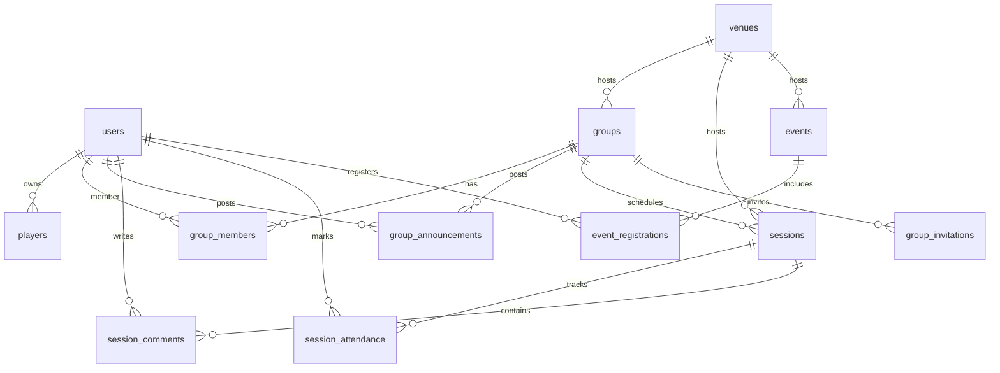

# Database Schema

## Overview
The database is a normalized PostgreSQL schema designed for club operations. It models users, player profiles, training groups, sessions, attendance, comments, and events. The schema is implemented with Drizzle ORM and runs on Neon.

## Normalization
- **Users** store authentication and identity
- **Players** represent child profiles linked to parent accounts
- **Groups** model training cohorts
- **Sessions** belong to groups
- **Attendance** and **comments** attach to sessions
- **Events** provide public club activities with registrations

## Indexing Strategy
- Primary keys on all tables
- Foreign key indexes for join-heavy queries
- Dedicated indexes for attendance, invitations, and registration lookups

## Table Documentation

### users
- **Purpose**: Authentication and identity
- **Important columns**: `email`, `password_hash`, `name`, `role`, `photo_url`
- **Foreign keys**: None
- **Relationships**: Owns players, authors comments and announcements, registers for events

### players
- **Purpose**: Player profiles linked to a parent user
- **Important columns**: `name`, `birth_year`, `skill_level`, `parent_user_id`
- **Foreign keys**: `parent_user_id` → users.id
- **Relationships**: Belongs to users, appears in attendance and group membership

### venues
- **Purpose**: Training and event locations
- **Important columns**: `name`, `address`, `city`, `archived_at`
- **Foreign keys**: None
- **Relationships**: Linked to sessions and events

### groups
- **Purpose**: Training groups for members
- **Important columns**: `title`, `level`, `min_age`, `max_age`, `venue_id`
- **Foreign keys**: `venue_id` → venues.id
- **Relationships**: Owns sessions, has members and invitations

### group_members
- **Purpose**: User or player membership in a group
- **Important columns**: `group_id`, `user_id`, `player_id`, `role`
- **Foreign keys**: `group_id` → groups.id, `user_id` → users.id, `player_id` → players.id
- **Relationships**: Connects users/players to groups

### group_announcements
- **Purpose**: Group-wide announcements for members
- **Important columns**: `group_id`, `author_id`, `title`, `content`, `created_at`
- **Foreign keys**: `group_id` → groups.id, `author_id` → users.id
- **Relationships**: Announcements belong to groups and are authored by users

### sessions
- **Purpose**: Scheduled training sessions
- **Important columns**: `group_id`, `session_date`, `start_time`, `venue_id`, `coach_user_id`, `capacity`, `canceled`
- **Foreign keys**: `group_id` → groups.id, `venue_id` → venues.id, `coach_user_id` → users.id
- **Relationships**: Owns attendance and comments

### session_attendance
- **Purpose**: Attendance marks per session/player
- **Important columns**: `session_id`, `player_id`, `parent_user_id`, `status`, `note`
- **Foreign keys**: `session_id` → sessions.id, `player_id` → players.id, `parent_user_id` → users.id
- **Relationships**: Links players and parents to sessions

### session_comments
- **Purpose**: Comments on sessions
- **Important columns**: `session_id`, `user_id`, `commented_at`, `text`
- **Foreign keys**: `session_id` → sessions.id, `user_id` → users.id
- **Relationships**: User comments per session

### events
- **Purpose**: Club events such as tournaments and camps
- **Important columns**: `title`, `event_date`, `venue_id`, `capacity`, `canceled`
- **Foreign keys**: `venue_id` → venues.id
- **Relationships**: Owns event registrations

### event_registrations
- **Purpose**: User/player registrations for events
- **Important columns**: `event_id`, `user_id`, `player_id`, `status`, `registered_at`
- **Foreign keys**: `event_id` → events.id, `user_id` → users.id, `player_id` → players.id
- **Relationships**: Join table for events

### group_invitations
- **Purpose**: Invitation links for group membership
- **Important columns**: `group_id`, `invite_code`, `used_at`, `user_id`
- **Foreign keys**: `group_id` → groups.id, `user_id` → users.id
- **Relationships**: Links invites to groups and accepting users

## ERD (Mermaid)

## Relationship Highlights
- USERS owns PLAYERS
- GROUPS contain SESSIONS
- SESSIONS contain ATTENDANCE and COMMENTS
- EVENTS contain REGISTRATIONS
